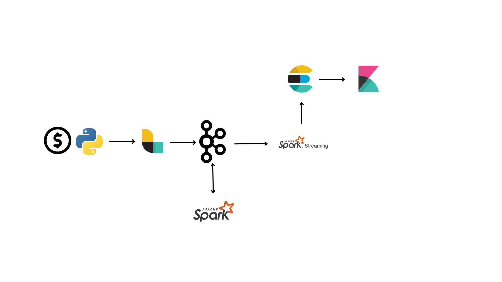
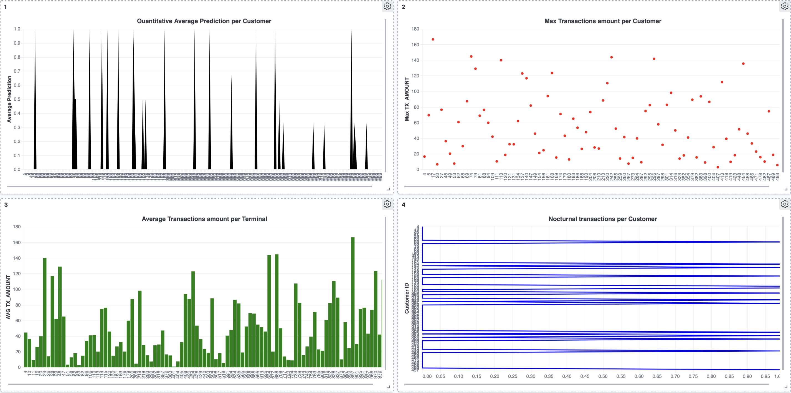

# Credit card fraud analysis

This project is meant to analyse every day transactions(every 24 hrs the transaction generator sends the data to logstash) in order to detect frauds within transactions through linear regression. The whole data is processed through a pipeline which features: Logstash, Kafka, 
Spark, Elasticsearch and Kibana.



## Requirements

Docker is crucial for this pipeline, so make sure to install it before running everything. You'll need to install [spark](https://archive.apache.org/dist/spark/spark-3.1.1/pyspark-3.1.1.tar.gz) and place the .tar file in the "spark/setup/" directory.

## Usage

In order to run the pipeline, start docker. Then go to the "bin/" directory and run:

if you are on Linux:

```bash
./setup.sh
```

if you're on MacOS:

```bash
sh setup.sh
```
If you're on Windows, click the "setup.cmd" file.

After doing so, go to the root directory of the project and execute:

```bash
docker-compose up -d
```

The generator has a timeout of 60 seconds so that the other containers have time to fully start. When the data has been sent and elaborated have fun with kibana(http://localhost:5601) :)



